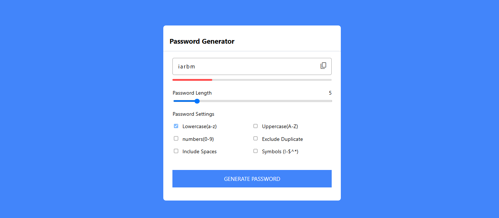
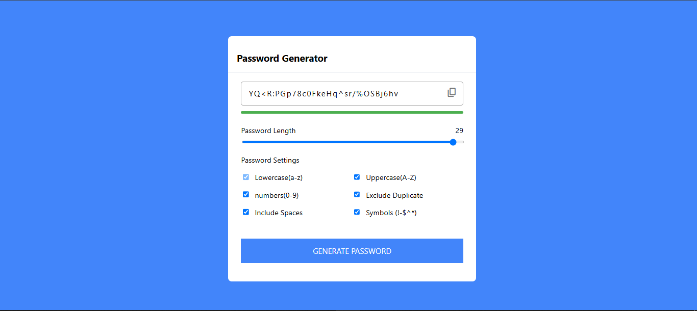

# 🔐 Password Generator

A modern and interactive Password Generator web application that allows users to generate secure passwords based on customizable settings like length, character types, and more. Built using **HTML, CSS, and JavaScript**.

---
## 🚀 Features & Functionalities

- 🎛 Adjustable password length using a slider
- 🔠 Character options:
    - Lowercase
    - Uppercase
    - Numbers
    - Symbols
    - Spaces
- ✅ Option to exclude duplicate characters
- 💪 Password strength indicator (with color feedback)
- 📋 Copy password to clipboard with one click
- ✅ “Copied” popup for user feedback
- 🔄 Instant password regeneration on option change

---

## 🛠 Technologies Used

- **HTML**
- **CSS** (with custom styles and animations)
- **JavaScript** (vanilla, no frameworks)

---
## 📸 Screenshots

| Week Password Example                          | Strong Password Example             |
|------------------------------------------------|-------------------------------------|
|  |  |

