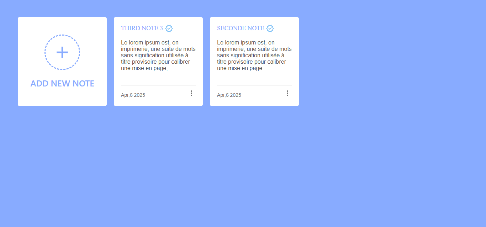
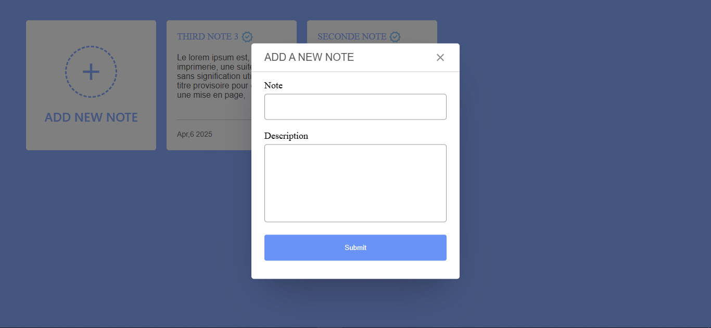
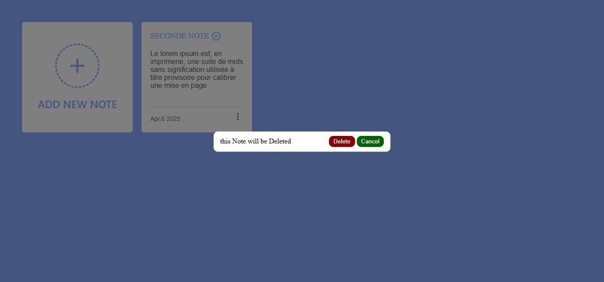

# 📝 Notes App

A simple and elegant Notes App built with **HTML**, **CSS**, and **JavaScript**. Users can add, edit, and delete notes. All data is stored in the browser's **localStorage**, ensuring persistence between sessions.

---

## ✨ Features

- ✅ Add new notes with a title and description
- ✅ Edit existing notes
- ✅ Delete notes with confirmation
- ✅ Input validation with real-time feedback
- ✅ Notes preview with auto-truncated descriptions
- ✅ Clean and responsive design
- ✅ Data saved in `localStorage`

---

## 🛠️ Tech Stack

- **HTML5** — For the structure
- **CSS3** — For styling the layout
- **Vanilla JavaScript (ES6+)** — For interactivity and data handling

---

## 📦 Project Structure
```graphql
# Code & components for pages
./8-Notes-App/* 
  ├─ index.html
  ├─ styles.css
  ├─ script.js
  ├─ README.md
  ├─ assets
  │  ├─icons
  │  ├─ screnshots
```
## 📌 How to Use

Clone the repository:

```shell
git https://github.com/kimbo-slicee/JavaScript-Projects.git
```
Open the app:
Open index.html in your browser. No build or server needed!
## 🚨 Validation Rules
**Title**
1. [ ] Must contain 1 to 100 characters
2. [ ] Letters, numbers, spaces, and some punctuation allowed
**Description**
1. [ ] Up to 1500 characters
2. [ ] Supports all Latin-based characters (including accents), numbers, and punctuation

## 🧠 How It Works

* Notes are stored as an array of objects in localStorage
* Adding or editing a note updates the array and saves it
* Each note shows the date it was created
* Descriptions are truncated in the list view for better readability

## 📸 Screenshots

<div align="center">



</div>

## 📈 Potential Improvements

1. Search and filter functionality
2. Tagging or color-coding notes
3. Dark mode toggle
4. Cloud syncing via Firebase or an API

## 👨‍💻 Author

 Me 😁 Full-Stack Web Developer 📬 Connect with me