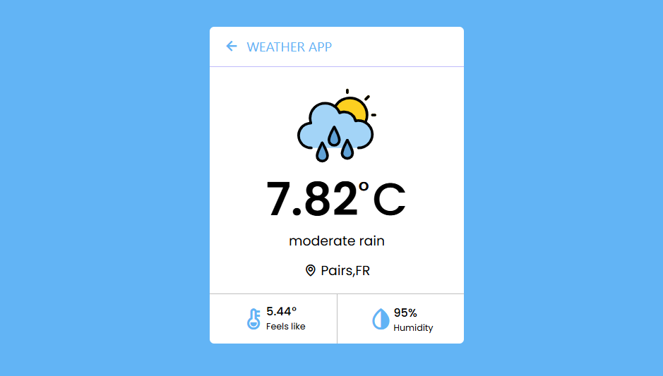

## 📸 Screenshots
<p align="center">

</p>

# 🌦️ Weather App

A modern weather application that allows users to check real-time weather conditions by entering a city name or using their current location. This project uses the [OpenWeather API](https://openweathermap.org/api) and is built with a **frontend-client** and a secure **Express.js backend proxy** to hide the API key from the browser.

---

## 🚀 Features

- 🔍 Search weather by **city name**
- 📍 Get weather for **current location** using `navigator.geolocation`
- 🔐 API key is **secured using a backend proxy** via Express.js
- 📦 Uses **fetch** on the backend to call external API
- 🌍 Displays temperature, weather condition, and location details

---

## 🛠️ Tech Stack

### Frontend:
- HTML, CSS, JavaScript
- Browser Geolocation API

### Backend:
- Node.js
- Express.js
- OpenWeather API
- `dotenv` for environment variable management

---

## 🧠 How It Works

1. The user either:
    - Types a city name and submits the form
    - Or clicks “Get My Location” to use GPS

2. The frontend sends a request to the **Express.js backend**, which:
    - Reads the city or coordinates
    - Calls the OpenWeather API using `fetch`
    - Sends the weather data back to the frontend

3. The frontend displays the current weather.

---

## 🔐 Why Use a Backend Proxy?

> To protect the OpenWeather API key from being exposed in the client-side JavaScript.

- The API key is stored securely in a `.env` file
- The server handles all API communication
- The frontend never sees the key 🔒
---

## 📁 Project Structure

```graphql
   project/back-end
   ├── controllers/ 
   │ └── weatherController.js 
   ├── routes/ 
   │ └── weather.router.js
   ├── .env 
   ├── .gitignore 
   ├── main.js
```
## 📦 Setup Instructions

1. **Clone the repository**
```bash
   git clone https://github.com/your-username/weather-app.git
   cd weather-app
```
2. **Install dependencies**
```bash
npm install
```
3. **Create a .env file**
```text
API_KEY=your_openweather_api_key_here
```
## 🧪 Future Improvements
1. Add weather icons and background animations
2. Implement 5-day forecast
3. Support multiple units (Celsius/Fahrenheit)
4. Deploy to Vercel/Render/Netlify + Railway/Render (backend)
